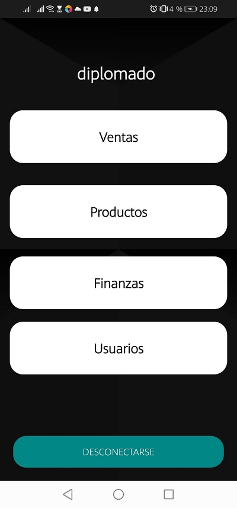

# Proyecto Final Test Automation Mobile

> Se realizó los Test de Automatización de la aplicación (Mi Inventario) en módulos Login, Logout, Productos, Ventas y Usuarios.
>
> [(Mi Inventario) en PlayStore](https://play.google.com/store/apps/details?id=com.vendetta.miinventario&hl=es)
>

# 👨‍💻 Stack Tecnológico

Para el presente proyecto se utilizó:

* [JUnit 5](https://junit.org/junit5/)
* [Appium Java Client](https://mvnrepository.com/artifact/io.appium/java-client)
* [Selenium](https://www.selenium.dev/)

# 👨‍💻 Herramientas

Se utilizó:

* [IntelliJ IDEA Community](https://www.jetbrains.com/)
* [Appium](https://appium.io/)
* [Appium Inspector](https://github.com/appium/appium-inspector)

## ✍ Autores

* Paola Urizar Orquides
* Noemi Rosario Ancari Villcarani
* Never Adrian Sossa

 